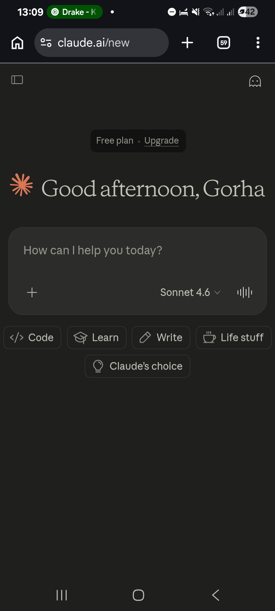
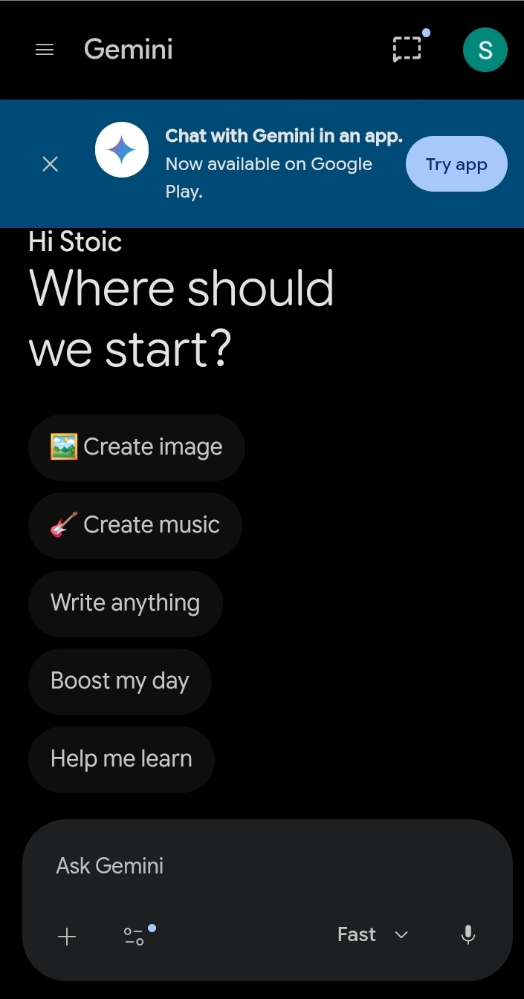
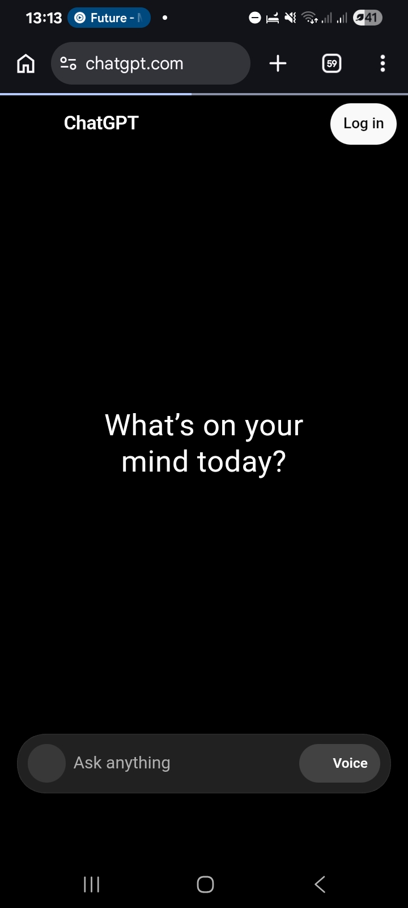

# Best Free AI Tools for Side Hustlers in 2026 (Tested & Ranked)

**Last Updated:** March 2026

If you're trying to build your own *Hustletopia* — a better life through smart side hustles — then **AI is one of your strongest tools**.

I’ve spent months testing dozens of AI platforms while building Hustletopia. Most are average. Only a few are truly powerful for people starting with zero budget.

Here’s my honest ranking of the **7 best free AI tools** for side hustlers in 2026.

**Affiliate Disclosure:** Some links on this page are affiliate links. If you make a purchase through them, I may earn a commission at no extra cost to you.

---

## Why AI Tools Are Perfect for Building Your Hustletopia

Most people fail at side hustles because they lack time, ideas, or money for tools. The right AI tools solve all three problems — and many of the best ones are completely free.

Here are the top 7 I personally use and recommend:

---

### 1. Grok (by xAI) — Best Overall for Hustlers

Grok is currently my #1 daily driver. It’s fast, honest, has real-time knowledge, and gives direct answers without corporate fluff.

**Best For:** Generating side hustle ideas, writing content, and getting straightforward advice.

**Pros & Cons**

| Pros                        | Cons                          |
|-----------------------------|-------------------------------|
| Very honest and useful      | Daily usage limits            |
| Real-time web access        | Image generation is limited   |
| Engaging personality        | Requires an X account         |

**My Rating:** 9.4/10

---

### 2. Claude 3.5 Sonnet — Best for Writing & Planning

Claude is excellent at long-form writing, creating plans, and structured thinking.

**Best For:** Writing blog posts, email sequences, and detailed hustle strategies.

**My Rating:** 9.2/10

---

### 3. ChatGPT (GPT-4o mini) — Most Versatile

The free version of ChatGPT remains extremely capable for everyday tasks.

**Best For:** General hustling tasks, learning new skills, and quick content creation.

**My Rating:** 8.7/10

---

### 4. Google Gemini — Best for Research

Gemini performs very well when you need accurate research, trend analysis, or data.

**My Rating:** 8.4/10

---

### 5. Perplexity AI — Best for Fast Research

Perplexity acts like a smart search engine that provides sources with every answer.

**My Rating:** 8.2/10

---

### 6. Leonardo.AI — Best Free Image Generator

Excellent for creating YouTube thumbnails, Pinterest pins, and social media graphics.

**My Rating:** 8.3/10

---

### 7. CapCut — Best Free AI Video Editor

CapCut’s built-in AI tools (auto captions, effects, script suggestions) make creating short-form videos very easy.

**My Rating:** 8.6/10

---

## My Personal Hustletopia AI Workflow

I usually follow this order:

1. **Idea Generation** — Grok  
2. **Research** — Perplexity + Gemini  
3. **Writing & Planning** — Claude 3.5 Sonnet  
4. **Visuals** — Leonardo.AI  
5. **Video Creation** — CapCut

This complete system costs **nothing**.

---

## Final Ranking (2026)

| Rank | Tool               | Score | Best For                     |
|------|--------------------|-------|------------------------------|
| 1    | Grok               | 9.4   | Overall + Ideas              |
| 2    | Claude 3.5         | 9.2   | Writing & Planning           |
| 3    | ChatGPT            | 8.7   | General Use                  |
| 4    | CapCut             | 8.6   | Video Content                |
| 5    | Gemini             | 8.4   | Research                     |
| 6    | Leonardo.AI        | 8.3   | Images & Thumbnails          |
| 7    | Perplexity         | 8.2   | Fast Research                |

---

## Final Thoughts

Building your Hustletopia doesn’t require being rich or highly technical. It requires consistency and using the right free tools.

Start with **Grok and Claude** — master those two and you’ll already be ahead of most people.

Ready to begin your journey? Try my **[Random Side Hustle Generator](/)** and get a fresh idea right now.

---

### What to do now:

1. Replace the content in `best-free-ai-tools-2026.md` with the code above.
2. Commit the changes.
3. Wait 20–30 seconds and test the article by clicking “Latest Article” on your homepage.

---

Let me know once you’ve updated it. After that, would you like me to:

- Add **more ideas** to the Random Side Hustle Generator?
- Write **Article #2**?
- Improve the **About page** to match the new Hustletopia branding?

Just tell me what you want next.
